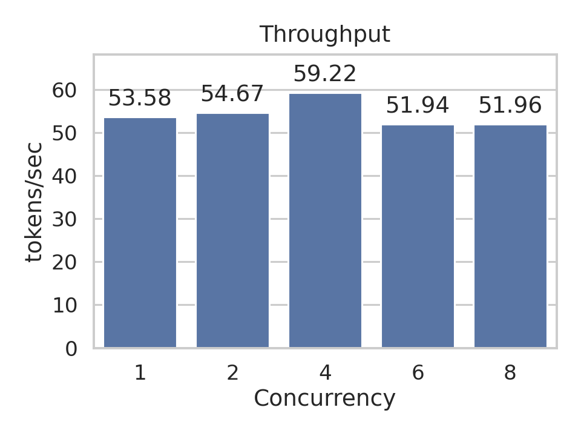
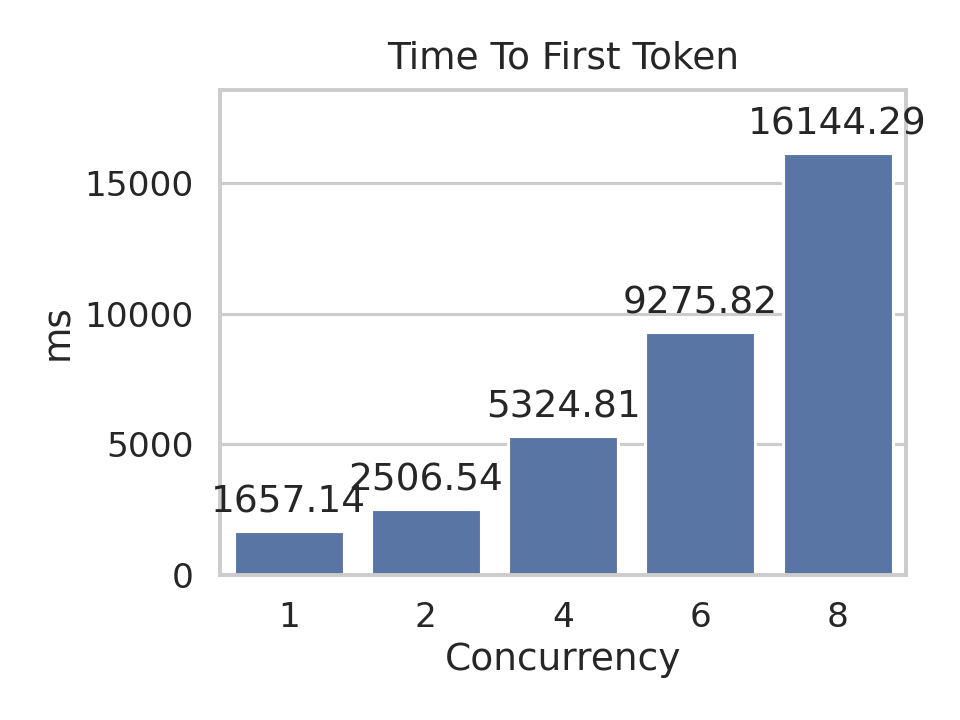
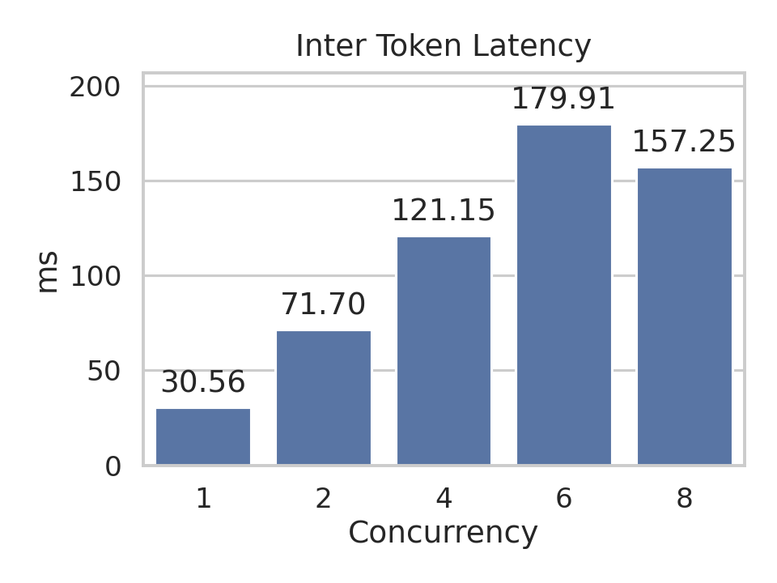
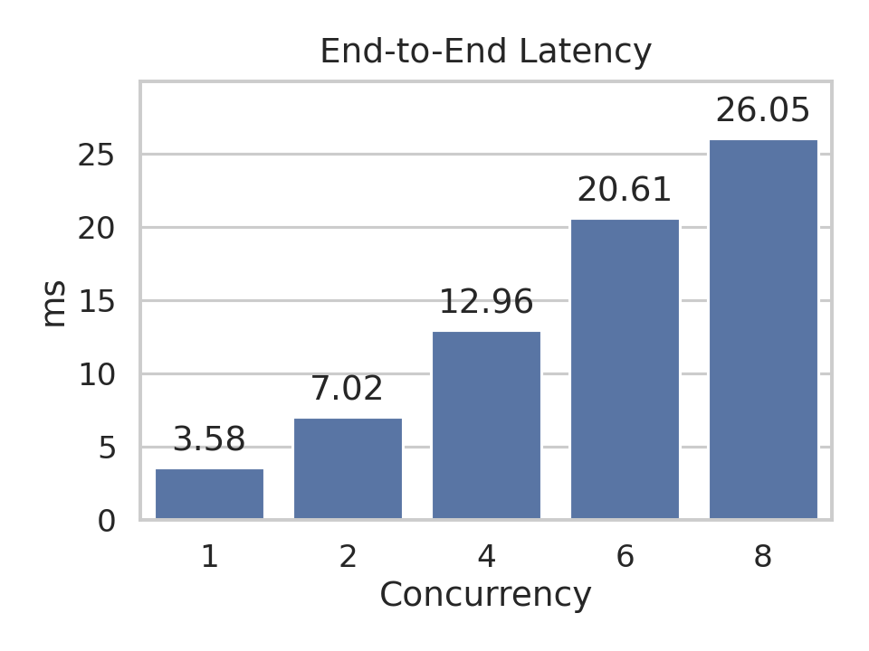

## Part 1: Deploy an Open-Source LLM
My local hardware (AMD CPU with a discrete GPU) is too slow for LLM inference, so I looked for free platforms. I tried Google Colab—got a GPU, but time-limited sessions made experimentation impractical. GitHub Actions on CPU proved better: reliable runs, Docker is straightforward (unlike Colab), my code is already there, and I can fan out multiple jobs to test different servers and configurations. In CI I evaluated two stacks: vLLM and llama.cpp (several variants). I chose llama.cpp with OpenCL as the fastest. Due to hardware limits, I’m using a smaller, quantized, and more modern model: meta-llama/Llama-3.2-1B-Instruct.

### setup the server
#### install depends
```bash
# choose your own opencl - this is opencl for cpu.
sudo apt-get install -y libcurl4-openssl-dev ocl-icd-opencl-dev pocl-opencl-icd clinfo
```
#### clone llama.cpp repo
```bash
git clone https://github.com/ggml-org/llama.cpp --depth 1 -b b6529
```
#### compile llama.cpp with opencl
```bash
# Build llama.cpp with opencl
cd llama.cpp
cmake -S . -B build \
  -DLLAMA_BUILD_EXAMPLES=OFF \
  -DLLAMA_BUILD_TESTS=OFF \
  -DGGML_OPENCL=ON \
  -DCMAKE_BUILD_TYPE=Release
cmake --build build -j $(nproc)
cd ..
```
#### download, convert and quantize
```bash
cd llama.cpp
# from inside llama.cpp/
pip install -r requirements/requirements-convert_hf_to_gguf.txt
export HF_TOKEN="<hugging face token>"
python3 convert_hf_to_gguf.py \
  --remote \
  --outtype f16 \
  --outfile models/llama-3.2-1b-instruct-f16.gguf \
  meta-llama/Llama-3.2-1B-Instruct

# optional quantization
build/bin/llama-quantize models/llama-3.2-1b-instruct-f16.gguf \
          models/llama-3.2-1b-instruct-q4_k_m.gguf q4_K_M
cd ..
```
#### run llama.cpp server
```bash
cd llama.cpp
# from inside llama.cpp/
build/bin/llama-server \
  --model models/llama-3.2-1b-instruct-q4_k_m.gguf \
  --alias meta-llama/Llama-3.2-1B-Instruct \
  --threads $(nproc) \
  --parallel $(nproc) \
  --host 0.0.0.0 \
  --ctx-size 4096 \
  --port 8000 &
cd ..
```

## Part 2: Benchmark the Deployed Model
The CI runner has 4 CPU cores, so the server runs with 4 threads and a 1024-token context. 4096 context size divide for 4 parallel jobs is 1024-token context for each job. I chose Guidellm because it was recommended and ships ready-made tests.
For Guidellm I set prompt_tokens=128 and output_tokens=64 so four parallel requests stay within the 1,024-token cap with buffer. I profiled concurrency at 1, 2, 4, 6, 8 two jobs below 4 and 2 jobs above, up to 2x the server's parallel capacity. To keep each run under 3 minutes, I ran 24 total requests.

### Install guidellm
```bash
pip install guidellm
```
### Run benchmark
```bash
echo Starting Benchmarking:
for i in 1 2 4 6 8; do
  start=$(date +%s)
  echo Benchmarking concurrency $i:
  guidellm benchmark \
    --target "http://localhost:8000" \
    --rate-type concurrent \
    --rate $i \
    --max-requests 24 \
    --data "prompt_tokens=128,output_tokens=64" \
    --output-path "./benchmark-results/$i.json"
  end=$(date +%s)
  elapsed=$(( end - start ))
  echo Benchmarking concurrency $i Finished
  echo "Elapsed: $((elapsed/60)) minutes $((elapsed%60)) seconds"
  echo " "
done
```

### raw results
Raw json results are store in benchmark-results folder
[benchmark-results](./benchmark-results)

## Part 3: Visualize and Analyze the Results

### Throughput
Throughput (tokens/sec) vs. number of concurrent requests:


### Time-to-first-token 
Time-to-first-token (ms) vs. number of concurrent requests:


### Inter token latency
Inter token latency (ms) vs. number of concurrent requests:


### End-to-End latency
End-to-End latency (ms) vs. number of concurrent requests:


### Analysis
The results show classic saturation. Throughput climbs as concurrency increases until four concurrent jobs, which matches the server’s parallel capacity on this machine. Beyond that point (six and eight) throughput flattens or dips slightly because requests are now competing for the same cores, causing contention and context switching rather than true parallel work. In parallel, time-to-first-token rises steadily with concurrency because later requests wait in the queue while earlier ones complete. once the system is saturated, each extra request adds wait time without adding useful compute.

Where do you observe performance bottlenecks?
On throughput, the bottleneck appears at 4 concurrent jobs. This matches the server configuration, which was set to handle 4 parallel jobs, so the leveling off in tokens per second is an expected outcome. Beyond this point, adding more jobs does not increase throughput since the server cannot process more jobs in parallel.
On latency, the results show that TTFT increases sharply once the load exceeds 8 concurrent jobs. This suggests that the batch size setting is contributing to additional queuing delay. In llama.cpp, the --batch-size parameter defines how many tokens are processed in a single step. Reducing this value allows requests to start sooner, which helps keep latency under control. The trade-off is that smaller batch sizes limit throughput, so the optimization is about finding the right balance between responsiveness and sustained performance.


What is one potential optimization you would explore next to improve
performance?

Another optimization I can suggest is switching from 4-bit to 5-bit quantization (use a q5_k_m GGUF instead of q4_k_m). On CPU, some kernels pack and vectorize 5-bit weights more efficiently than 4-bit, so even though the model is slightly larger in memory, per-token compute can be smoother with fewer de-quantization stalls. The result is often higher sustained tokens/sec and more stable TTFT at moderate concurrency. I’m choosing this because your VM has enough RAM to absorb the ~20–30% size increase, while your current bottlenecks are uneven throughput and TTFT spikes under load.

### Reports tools to install
```bash
pip install pandas seaborn matplotlib
```

### Code to generate reports
[create_reports.py](./scripts/create_reports.py)
