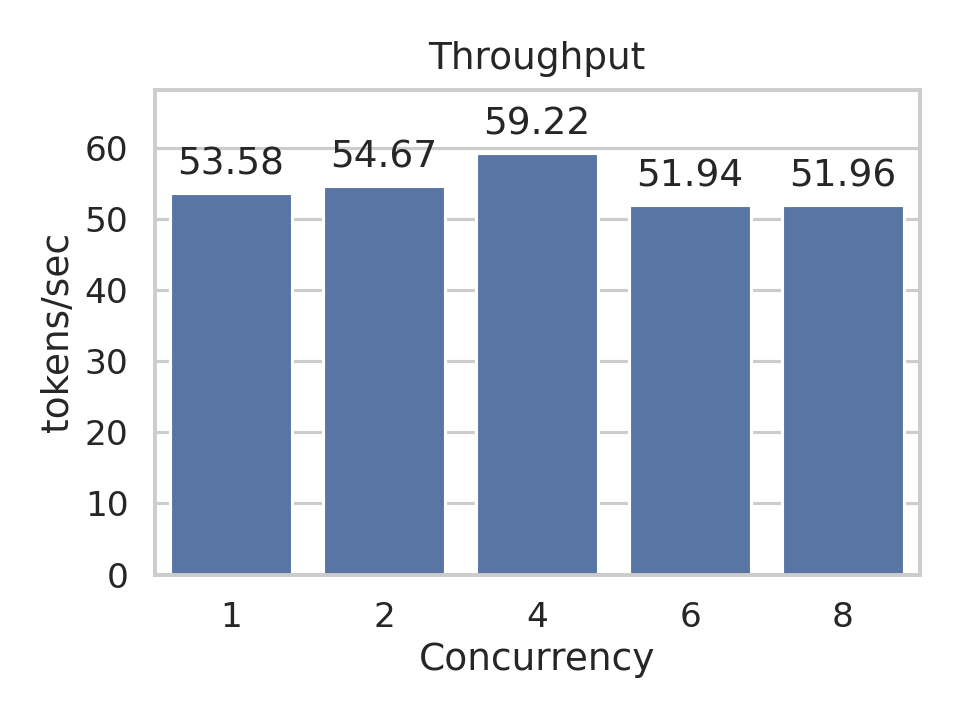
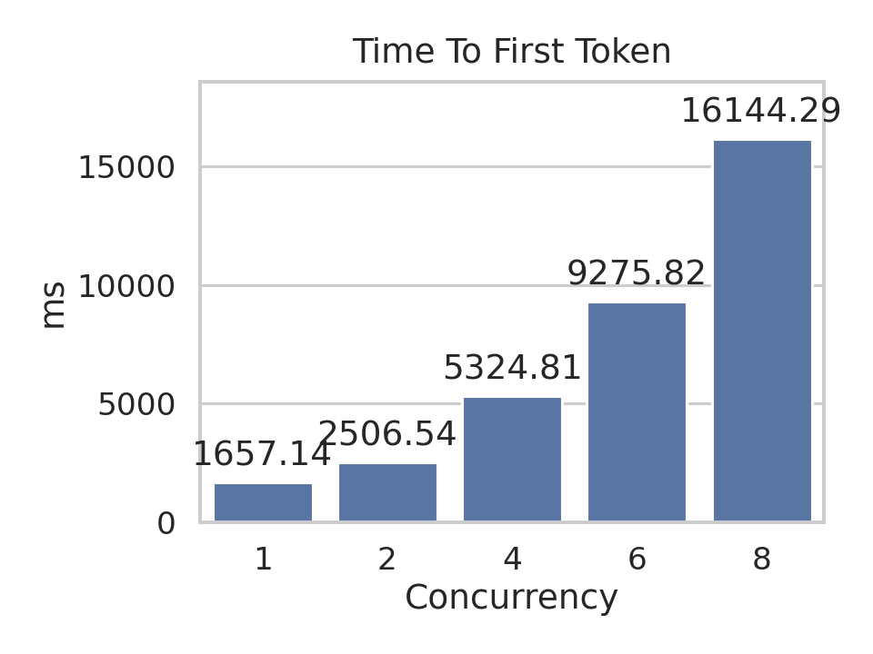
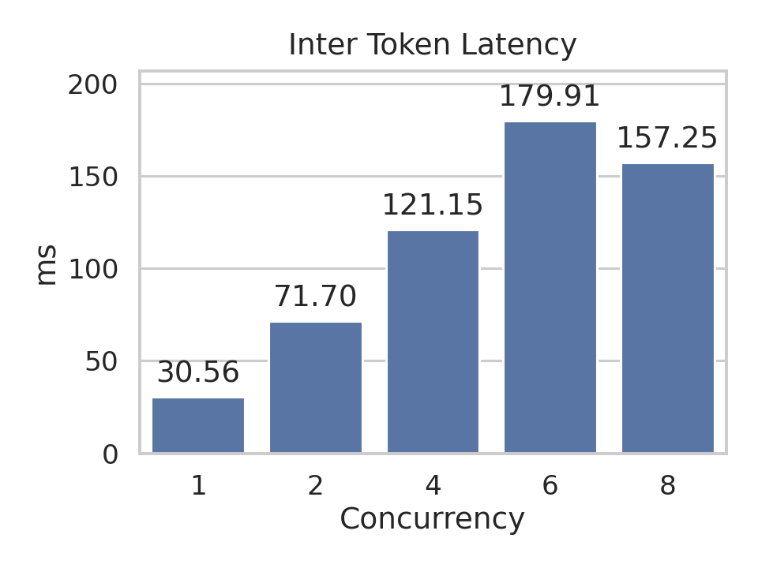
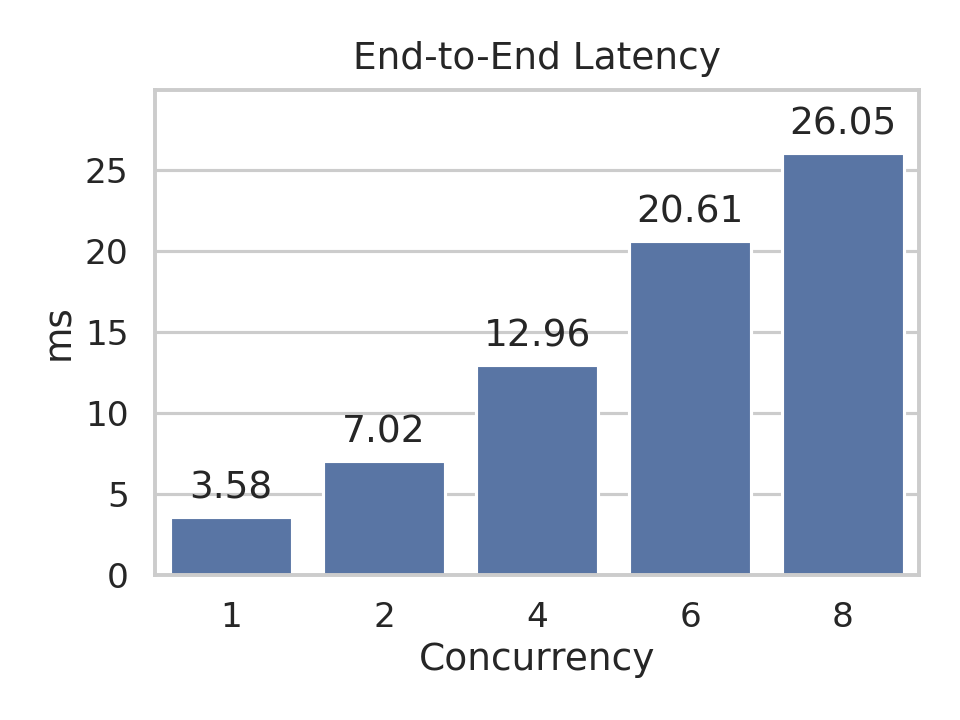

## Part 1: Deploy an Open-Source LLM
I have an hardware limitation. I have an amd cpu with dedicate gpu. 
It very slow to run llm, and it not feasible.
I explore open and free platform that I can run an llm.
I explore 2 options. First I try google colab, I got a gpu, but it was time base, make it hard to explore and make experiments. Then I check github action with cpu.
I get reliable way to run my code, include having docker, that it hard to setup on colab. Also my code is already here, and it more organize.
Another bonus to run on ci, that I can create several jobs with different variants and explore more server and ways to run llms.
I explore some options and end up with 2 options that runs here in the ci.
1. is vllm
2. llama.cpp with many variants.

I choose to llama.cpp with opencl because is the fastest choice from them all.
I run smaller model than one suggested and more modern:
Because hardware limitation, I run smaller model with quantization 
meta-llama/Llama-3.2-1B-Instruct.

### setup the server
#### install depends
```bash
# choose your own opencl - this is opencl for cpu.
sudo apt-get install -y libcurl4-openssl-dev ocl-icd-opencl-dev pocl-opencl-icd clinfo
```
#### clone llama.cpp repo
```bash
git clone https://github.com/ggml-org/llama.cpp --depth 1 -b b6529
```
#### compile llama.cpp with opencl
```bash
# Build llama.cpp with opencl
cd llama.cpp
cmake -S . -B build \
  -DLLAMA_BUILD_EXAMPLES=OFF \
  -DLLAMA_BUILD_TESTS=OFF \
  -DGGML_OPENCL=ON \
  -DCMAKE_BUILD_TYPE=Release
cmake --build build -j $(nproc)
cd ..
```
#### download, convert and quantize
```bash
cd llama.cpp
# from inside llama.cpp/
pip install -r requirements/requirements-convert_hf_to_gguf.txt
export HF_TOKEN="<hugging face token>"
python3 convert_hf_to_gguf.py \
  --remote \
  --outtype f16 \
  --outfile models/llama-3.2-1b-instruct-f16.gguf \
  meta-llama/Llama-3.2-1B-Instruct

# optional quantization
build/bin/llama-quantize models/llama-3.2-1b-instruct-f16.gguf \
          models/llama-3.2-1b-instruct-q4_k_m.gguf q4_K_M
cd ..
```
#### run llama.cpp server
```bash
cd llama.cpp
# from inside llama.cpp/
build/bin/llama-server \
  --model models/llama-3.2-1b-instruct-q4_k_m.gguf \
  --alias meta-llama/Llama-3.2-1B-Instruct \
  --threads $(nproc) \
  --host 0.0.0.0 \
  --port 8000 &
cd ..
```

## Part 2: Benchmark the Deployed Model
Because hardware limitations, I limit the server to run 4 threads because I have 4 cores cpu in the ci.
Also I load the model with 1024 token limit.
I choose guidellm because it was one of the recommendations, also it doing all the tests out of the box. One limitation that I discover for this tool that it only accept old openai api, and it hard to work with tools that support the new api only. I already submit an issue to this tool.
For guidellm I choose `prompt_tokens=128,output_tokens=64` that are small because to fit in 4 parallel of max token of 1024 with some buffer. Then I run in concurred mode 1,2,4,6,8. two points below 4, and 2 points after 4, and reach to double of the amount of the server parallel jobs that he can serve. 
I wanted it will finish the run in feasible time: no more for 3 minutes for run,
then I choose the run will be 3 times for the maximum concurred run. I choose 8*3 = 24 max requests.

### Install guidellm
```bash
pip install guidellm
```
### Run benchmark
```bash
echo Starting Benchmarking:
for i in 1 2 4 6 8; do
  start=$(date +%s)
  echo Benchmarking concurrency $i:
  guidellm benchmark \
    --target "http://localhost:8000" \
    --rate-type concurrent \
    --rate $i \
    --max-requests 24 \
    --data "prompt_tokens=128,output_tokens=64" \
    --output-path "./benchmark-results/$i.json"
  end=$(date +%s)
  elapsed=$(( end - start ))
  echo Benchmarking concurrency $i Finished
  echo "Elapsed: $((elapsed/60)) minutes $((elapsed%60)) seconds"
  echo " "
done
```

### raw results
Raw json results are store in benchmark-results folder
[benchmark-results](./benchmark-results)

## Part 3: Visualize and Analyze the Results

### Throughput
Throughput (tokens/sec) vs. number of concurrent requests:


### Time-to-first-token 
Time-to-first-token (ms) vs. number of concurrent requests:


### Inter token latency
Inter token latency (ms) vs. number of concurrent requests:


### End-to-End latency
End-to-End latency (ms) vs. number of concurrent requests:


### Analysis
What do the results tell you about the performance of your serving setup?
The results tell me that as long I increase the concurrency the throughput will increased until it hit the limit (4 concurrency jobs) because I set up my server to be 4 parallel jobs because the cpu have 4 cores. After 4 in 6 and 8, the throughput are slight decreased and stay the same. It decrease because now the server also need to deal with upcoming request that is waiting.
Also I see as long I increase the concurrency the Time-to-first-token are increased. This is expected because now the last request is waiting until other request will finished, and when the concurrency is increased there are more requests to wait for.

Where do you observe performance bottlenecks?
On the throughput I see the bottleneck on the 4 concurrency, because the server is set to serve 4 parallel jobs. this is expected results.
From the benchmark results, we observed that TTFT increases sharply once concurrency exceeds 8 concurrency. This indicates that the dynamic batching mechanism is introducing additional queuing delay.
As a next optimization, I would explore tuning batch scheduling parameters — specifically reducing maximum batch size and adjusting batching timeouts — to strike a better balance between throughput and latency. If these software-level optimizations do not sufficiently reduce TTFT under load, the next step would be to explore scaling out with more CPU cores or switch to GPU.


What is one potential optimization you would explore next to improve
performance?
I already did the quantization for the model, but I didn't measure how it effect the performance, both in run time and quality performance.
Another things I notice that the inter token is 

### Reports tools to install
```bash
pip install pandas seaborn matplotlib
```

### Code to generate reports
[create_reports.py](./scripts/create_reports.py)
